## Introduction

- Physical activity known to predict health outcomes such as mortality/disease (AD, Parkinson's, etc.) effectively
- Existing research uses thresholded MIMS^[Monitor Independent Movement Summary] measures (e.g. MIMS $\ge 10$) or **scalar** summaries (e.g. mean activity) as outcomes; 
- To fully use the information in MIMS, we need to understand its structure and its relationship to patient characteristics.

## NHANES Movement Data

- 2011-2012 and 2013-2014 NHANES waves
- Minute-level accerlerometer data summarized as **Monitor Independent Movement Summary (MIMS)**; larger values indicate more movement; 
- $N=7578$, excluding incomplete data;^[Link to dataset: https://functionaldataanalysis.org/dataset_nhanes.html; Crainiceanu, C.M., Goldsmith, J., Leroux, A., & Cui, E. (2024). Functional Data Analysis with R (1st ed.)]
- **Predictors**: Age, BMI, Poverty Income Ratio (Continuous); Sex, coronary heart disease history (Binary); Race, Education (Categorical)

## 

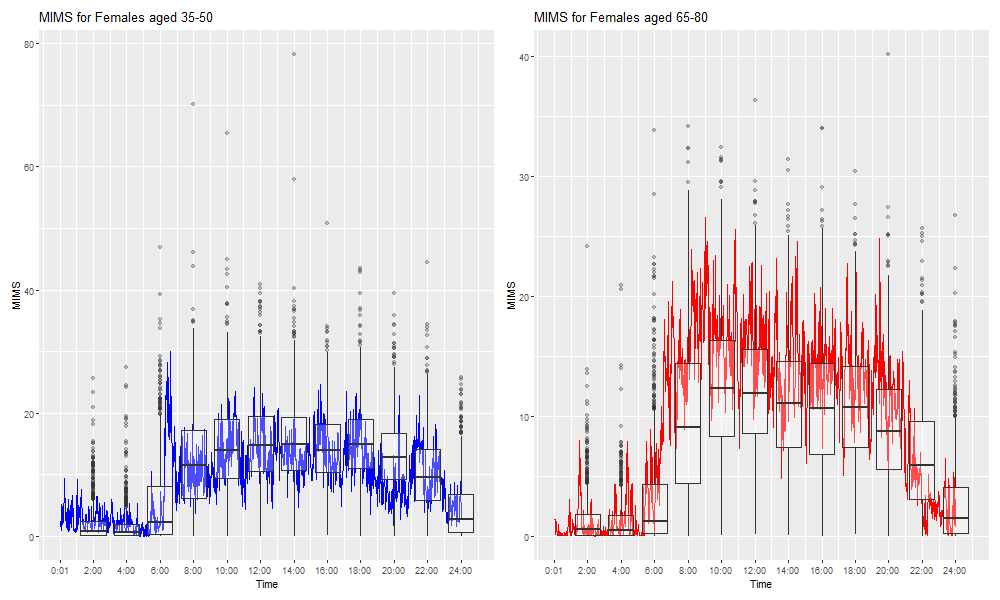

##

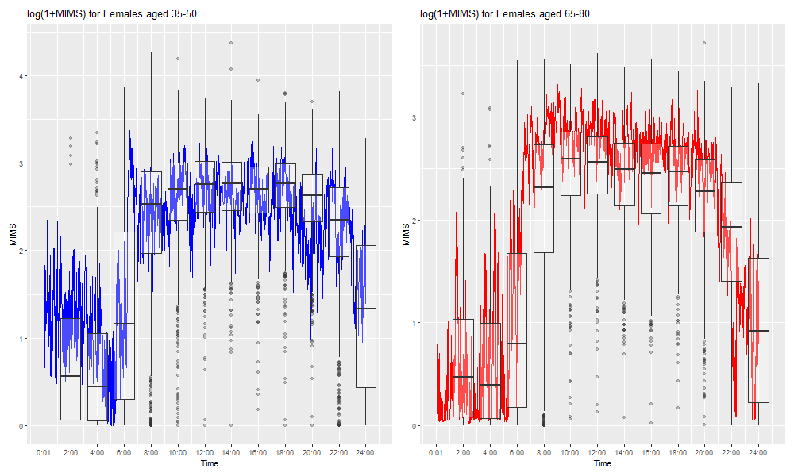

## Moment before/after Logging

::: {layout-ncol=2}

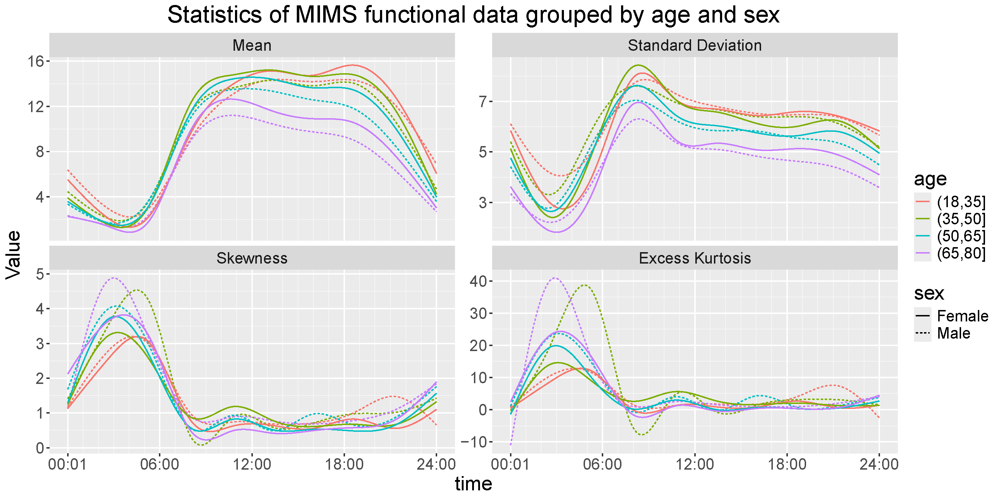

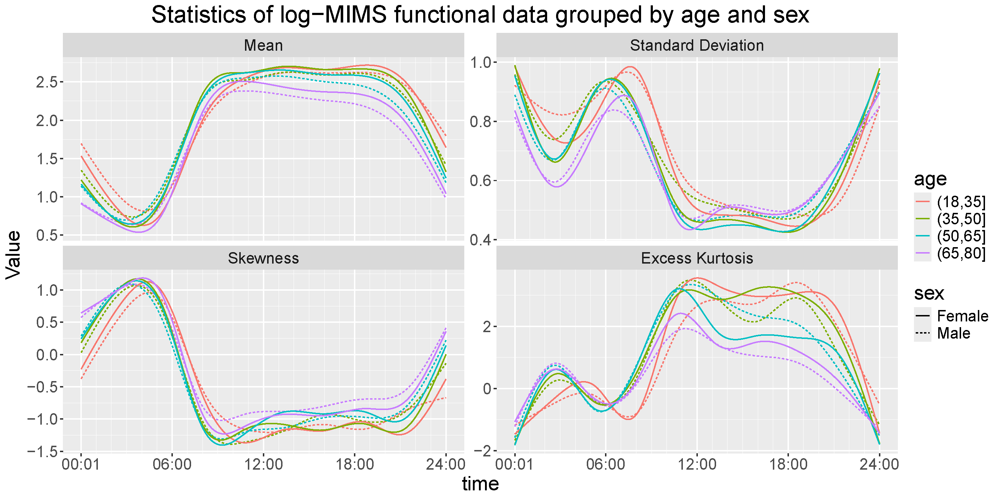

:::

- Data can be skewed and have non-Gaussian tails
- All four moments shows differences across subgroups
- Transformation might retain or even induce non-Gaussianity

## General Model Setting

In typical functional regression tasks, the mean relationship between the outcome, $Y(s)$, and covariate vector $X$ are modeled under GP assumption

$$
Y_i(s)=\mu_i(s;X)+\epsilon_i(s)~,\epsilon_i(s) \sim \mathcal{GP}(0, V(\cdot,\cdot))
$$
$V$ is the covariance operator, and does NOT depend on $X$.

- How can we examine this assumption?
- Direct testing for any finite subset of $s$?

## Methodology

We approach this using mixed-effect modeling with splines:
$$
\small
\begin{aligned}
Y_i(s)&=\overset{\text{(Fixed Effect)}}{\mu_i(s)}&+&\overset{\text{(Random Effect)}}{b_i(s)}&+&\overset{\text{(Residual Noise)}}{\epsilon_i(s)}\\
Y_i(s)&=\sum\limits_{p=1}^PX_{ip}A_p(s)&+&\sum\limits_{j=1}^J\xi_{ij}\phi_j(s)&+&~~~~~~\epsilon_i(s)
\end{aligned}
$$

$~~~\small Y_i(s)=X_i\cdot$ 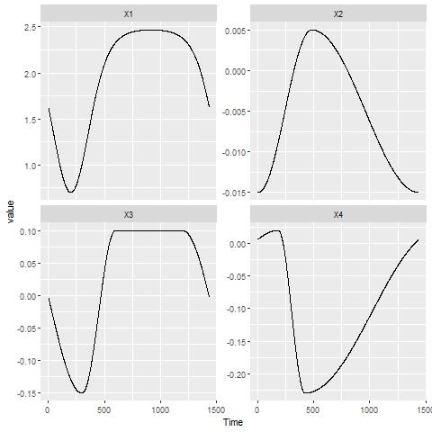{width=200px} + $~~~\small \xi_i\cdot$ 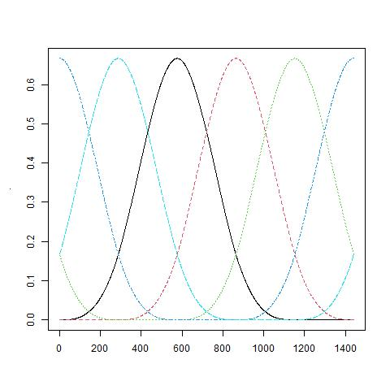{width=200px} + $~~~$ 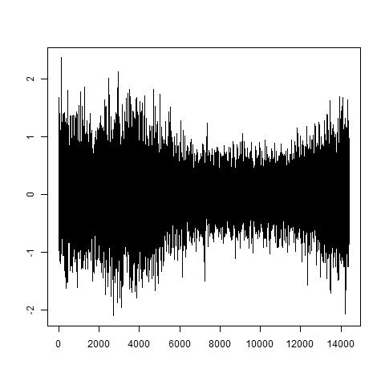{width=200px} 

## Violation of Assumptions in MIMS

We can regress our data on any spline basis and look at the spline coefficients; Non-ellipsoid shape means violation of GP

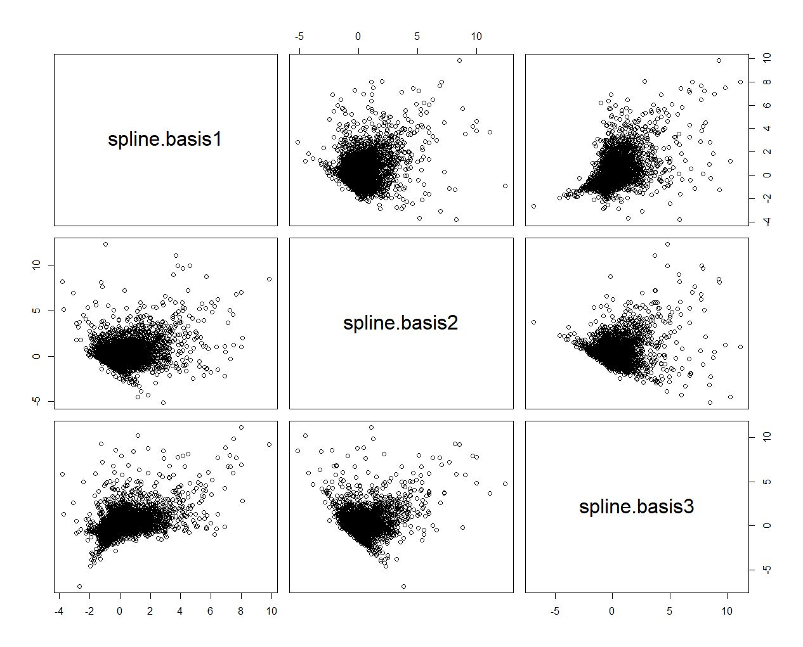{height=500px}

We can then apply simpler tests for normality (e.g. $\chi^2$ test with Mahalanobis distance)

## How Scores Affect Outcome

$$
Y_i(s)=\sum\limits_{p=1}^PX_{ip}A_p(s)+\sum\limits_{j=1}^J\xi_{ij}\phi_j(s)+\epsilon_i(s)
$$
When $\xi_{ij}$ has variance dependent on $X_i$, so does $Y_i(t)$:
$$
\begin{aligned}
\small Cov[Y_i(s_1),Y_i(s_2)|X_i]&=\sum\limits_{1\le j_1,j_2\le J}\mathbf{Cov(\xi_{ij_1},\xi_{ij_2}|X_i)}\phi_{j_1}(s_1)\phi_{j_2}(s_2)\\
&+Var[\epsilon_i(s_1)]\cdot\mathbb{I}[s_1=s_2]
\end{aligned}
$$

## How Scores Affect Outcome

$$
Y_i(s)=\sum\limits_{p=1}^PX_{ip}A_p(s)+\sum\limits_{j=1}^J\xi_{ij}\phi_j(s)+\epsilon_i(s)
$$
When $\xi$ has nonzero skewness/excess kurtosis, so would $Y_i(t)$:
$$
\begin{aligned}
&E\{[Y_i(s)-EY_i(s)]^3|X_i\}\\=&\sum\limits_{1\le j_1,j_2,j_3\le J}\mathbf{E[\xi_{ij_1}\xi_{ij_2}\xi_{ij_3}|X_i]}\phi_{j_1}(s)\phi_{j_2}(s)\phi_{j_3}(s)
\end{aligned}
$$

In short: As long as we can flexibly model moments of $\xi$'s, we can induce *any* kind of non-Gaussianity in $Y(s)$

## Results on NHANES: Skewness/Kurtosis

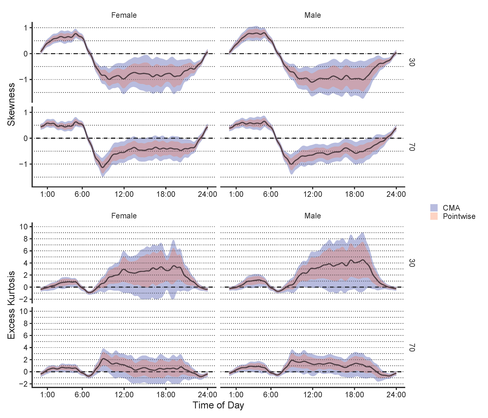

\tiny Takeaway: Older individuals' movement is more Gaussian (less outliers/more symmetric)

## Modeling Random Effect Terms

We choose to model $Var[\xi_{ij}]=E[\xi_{ij}^2]$ using log-linear model:
$$
\log E[\xi_{ij}^2]=X_i'\beta_j
$$
and $\mathrm{Cor}((\xi_{i1},\ldots,\xi_{iJ})')=C$, which is irrelevant of $X$.

Now the covariance operator for $Y_i(t)$ becomes
$$
\tiny
\begin{aligned}
\Sigma_i(s_1,s_2)&=\sum\limits_{j_1=1}^J\sum\limits_{j_2=1}^J(e^{X_i'\boldsymbol{\beta}_{j_1}})^{1/2}(e^{X_i'\boldsymbol{\beta}_{j_2}})^{1/2}C_{j_1,j_2}\phi_{j_1}(s_1)\phi_{j_2}(s_2)\\
&+\sigma^2_\epsilon(s_1)\mathbb{I}(s_1=s_2)
\end{aligned}
$$
- $Y_i(t)|X_i$ can be correlated even if $C$ is diagonal.

## Modeling Random Effect Terms

We can similarly model the skewness and kurtosis:

$$
\tiny
\begin{aligned}
Skew(\hat\xi_{ij})\approx E[\tilde{\xi_{ij}^*}^3]&=X_i'\delta_{\text{skew},j}\\
Kurt(\hat\xi_{ij})\approx E[\tilde{\xi_{ij}^*}^4-3]&=\exp(X_i'\delta_{\text{kurt},j})\\
(\tilde\xi_{ij}^*=\hat\xi_{ij}/SD(\hat\xi_{ij})\text{ is the }&\text{standardized score})
\end{aligned}
$$

as well as cross-products like $\xi_{i1}\xi_{i2}\xi_{i3}$, etc. (not shown here)

## Stepwise Parameter Estimation

We develop a pragmatic way of estimating the parameters one-by-one. Interval estimates are calculated using bootstrap, both pointwise and multiplicity adjusted ^[Crainiceanu, C.M., Goldsmith, J., Leroux, A., & Cui, E. (2024). Functional Data Analysis with R (1st ed.)]

**1-1:** For each time point $s_j$, regress $Y_i(s_j)$ on $X_{ip}$ for a raw estimate $\tilde A_p(s_j)$. Smooth^[Cui, E., Leroux, A., Smirnova, E., & Crainiceanu, C. M. (2021). Fast Univariate Inference for Longitudinal Functional Models. Journal of Computational and Graphical Statistics, 31(1), 219–230.] $\tilde A_p(s_1),\cdots,\tilde A_p(s_T)$ to get the final estimate of $\hat A_p(s)$.

**1-2:** Extract $1^{st}$-step residual $\small\hat r_i(s)=Y_i(s)-\sum\limits_{p}X_{ip}\hat A(s)$

## Stepwise Parameter Estimation

**2-1:** Regress residuals $\small\hat r_i(s)=Y_i(s)-\sum\limits_{p}X_{ip}\hat A(s)$ on $\small\phi_1(s),\cdots,\phi_J(s)$ with penalty to get score estimates $\hat\xi_{ij}$. Record effective degrees of freedom $edf_i$.

**2-2:** Perform GLM with log-linear model
$$
\small
{Var[\hat{\xi_{ij}}]\approx}E[\hat\xi_{ij}^2]=\exp(X_i'\beta_j);~~~ Var[\hat\xi_{ij}^2]\propto E[\hat\xi_{ij}^2]
$$

**2-3:** Recover $C$ from standardized scores $\small\hat{\xi_{ij}^*}=\hat{\xi_{ij}}(\exp(X_i'\beta_j))^{-1/2}$.

**2-4:** Recover $\small\sigma_\epsilon^2(s)$ via smoothing the squared-residual $[\hat r_i(s)-\sum_j\hat\xi_{ij}\phi_j(s)]^2$

## Finding Higher-order Moments

$$
\tiny
\begin{aligned}
Y_i(t)&={\sum\limits_{p=1}^PX_{ip}A_p(s)}+{\sum\limits_{j=1}^J\xi_{ij}\phi_j(s)}+{\epsilon_i(s)}
\end{aligned}
$$

**2-5:** Perform linear regression on:
$$
\tiny
\begin{aligned}
Skew(\hat\xi_{ij})\approx E[\tilde{\xi_{ij}^*}^3]&=X_i'\delta_{\text{skew},j}\\
Kurt(\hat\xi_{ij})\approx E[\tilde{\xi_{ij}^*}^4-3]&=\exp(X_i'\delta_{\text{kurt},j})
\end{aligned}
$$
and other cross-products, such as $\tilde{\xi_{i1}^*}^2\tilde{\xi_{i2}^*}$.^[$O(K^3+K^4)$ regressions are needed]

**2-6:** Recover skewness/kurtosis of $Y_i(s)|X_i$ using 2nd-4th moments of scores

## Interval Estimation

- Standard error estimated via nonparametric bootstrap, i.e. sample individuals w/ replacement

- Pointwise Wald intervals: $\pm 1.96\times SE$

- Correlation and Multiplicity Adjusted(CMA) interval[^1]: $\pm Q\times SE$

Should we use **symmetric** CI when we no longer assume symmetry in the data?

[^1]: Crainiceanu, C.M., Goldsmith, J., Leroux, A., & Cui, E. (2024). Functional Data Analysis with R (1st ed.)

## CMA Interval with Some Asymmetry

1. Calculate the pointwise sample variance $\small\hat D(t)=\hat{Var}(\hat f^*_i(t))$
2. Calculate the **maximum and minimum** Z-scores: $\small M_i=\max_t\frac{\hat f^*_i(t)-\bar f(t)}{\hat D(t)^{1/2}},m_i=\min_t\frac{\hat f^*_i(t)-\bar f(t)}{\hat D(t)^{1/2}}$
3. Let $\small Q_U$ be $\small 97.5\%$ quantile of $\small -m_1,-m_2,\cdots,-m_B$
3. Let $\small Q_L$ be $\small 2.5\%$ quantile of $\small -M_1,-M_2,\cdots,-M_B$
4. Calculate intervals $\small[\hat f_0(t)-Q_L\hat D(t)^{1/2},\hat f_0(t)+Q_U\hat D(t)^{1/2}]$

## Next steps

- Find ways to construct prediction intervals given $X_i$, accounting for non-Gaussian properties
- Identify outliers and classify/cluster them based on timing and extent of exceeding the prediction band

##

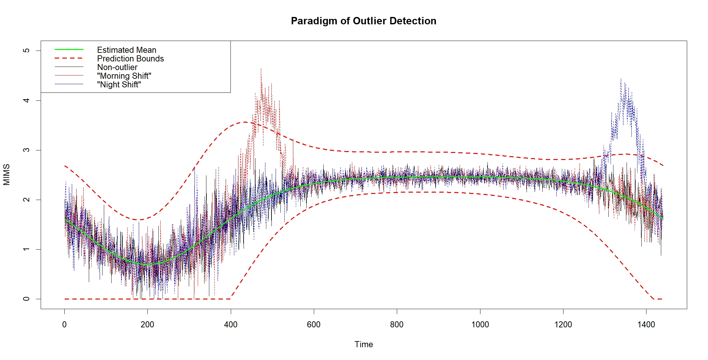

- How should we construct prediction intervals with non-Gaussianity in mind?
- How should we define *outliers* in movement patterns? e.g. How should we differentiate "meaningful" outliers that are not due to noises?

# Thank you!

## References

Cui, Erjia, Leroux, Andrew, Smirnova, Ekaterina and Crainiceanu, Ciprian M.
(2021). Fast univariate inference for longitudinal functional models. 

Crainiceanu, C.M., Goldsmith, J., Leroux, A. and Cui, E. (2024). Functional Data
Analysis with R

Backenroth, Daniel, Goldsmith, Jeff, Harran, Michelle D., Cortes, Juan C.,
Krakauer, John W. and Kitago, Tomoko. (2018). Modeling motor learning using heteroscedastic functional principal components analysis

## References

Cui, E., Leroux, A., Smirnova, E., & Crainiceanu, C. M. (2021). Fast Univariate Inference for Longitudinal Functional Models. 

Reiss, Philip T., Huang, Lei and Mennes, Maarten. (2010). Fast function-on-scalar regression with penalized basis expansions. 

Yi Zhao, Brian S Caffo, Xi Luo, For the Alzheimer’s Disease Neuroimaging Initiative, Longitudinal regression of covariance matrix outcomes

## Modeling Random Effect Terms

We choose to model $Var[\xi_{ij}]=E[\xi_{ij}^2]$ using log-linear model:
$$
\log E[\xi_{ij}^2]=X_i'\beta_j
$$
and $\mathrm{Cor}((\xi_{i1},\ldots,\xi_{iJ})')=C$, which is irrelevant of $X$.

Now the covariance operator for $Y_i(t)$ becomes
$$
\tiny
\begin{aligned}
\Sigma_i(s_1,s_2)&=\sum\limits_{j_1=1}^J\sum\limits_{j_2=1}^J(e^{X_i'\boldsymbol{\beta}_{j_1}})^{1/2}(e^{X_i'\boldsymbol{\beta}_{j_2}})^{1/2}C_{j_1,j_2}\phi_{j_1}(s_1)\phi_{j_2}(s_2)\\
&+\sigma^2_\epsilon(s_1)\mathbb{I}(s_1=s_2)
\end{aligned}
$$
- $Y_i(t)|X_i$ can be correlated even if $C$ is diagonal.

## Modeling Random Effect Terms

We can similarly model the skewness and kurtosis:

$$
\tiny
\begin{aligned}
Skew(\hat\xi_{ij})\approx E[\tilde{\xi_{ij}^*}^3]&=X_i'\delta_{\text{skew},j}\\
Kurt(\hat\xi_{ij})\approx E[\tilde{\xi_{ij}^*}^4-3]&=\exp(X_i'\delta_{\text{kurt},j})\\
(\tilde\xi_{ij}^*=\hat\xi_{ij}/SD(\hat\xi_{ij})\text{ is the }&\text{standardized score})
\end{aligned}
$$

## Stepwise Parameter Estimation

We develop a pragmatic way of estimating the parameters one-by-one. Interval estimates are calculated using bootstrap, both pointwise and multiplicity adjusted ^[Crainiceanu, C.M., Goldsmith, J., Leroux, A., & Cui, E. (2024). Functional Data Analysis with R (1st ed.)]

**1-1:** For each time point $s_j$, regress $Y_i(s_j)$ on $X_{ip}$ for a raw estimate $\tilde A_p(s_j)$. Smooth^[Cui, E., Leroux, A., Smirnova, E., & Crainiceanu, C. M. (2021). Fast Univariate Inference for Longitudinal Functional Models. Journal of Computational and Graphical Statistics, 31(1), 219–230.] $\tilde A_p(s_1),\cdots,\tilde A_p(s_T)$ to get the final estimate of $\hat A_p(s)$.

**1-2:** Extract $1^{st}$-step residual $\small\hat r_i(s)=Y_i(s)-\sum\limits_{p}X_{ip}\hat A(s)$

## Stepwise Parameter Estimation

**2-1:** Regress residuals $\small\hat r_i(s)=Y_i(s)-\sum\limits_{p}X_{ip}\hat A(s)$ on $\small\phi_1(s),\cdots,\phi_J(s)$ with penalty to get score estimates $\hat\xi_{ij}$. Record effective degrees of freedom $edf_i$.

**2-2:** Perform GLM with quasi-Poisson model
$$
\small
{Var[\hat{\xi_{ij}}]\approx}E[\hat\xi_{ij}^2]=\exp(X_i'\beta_j);~~~ Var[\hat\xi_{ij}^2]\propto E[\hat\xi_{ij}^2]
$$

**2-3:** Recover $C$ from standardized scores $\small\hat{\xi_{ij}^*}=\hat{\xi_{ij}}(\exp(X_i'\beta_j))^{-1/2}$.

**2-4:** Recover $\small\sigma_\epsilon^2(s)$ via smoothing the squared-residual $[\hat r_i(s)-\sum_j\hat\xi_{ij}\phi_j(s)]^2$

## Finding Higher-order Moments

$$
\tiny
\begin{aligned}
Y_i(t)&={\sum\limits_{p=1}^PX_{ip}A_p(s)}+{\sum\limits_{j=1}^J\xi_{ij}\phi_j(s)}+{\epsilon_i(s)}
\end{aligned}
$$

**2-5:** Perform linear regression on:
$$
\tiny
\begin{aligned}
Skew(\hat\xi_{ij})\approx E[\tilde{\xi_{ij}^*}^3]&=X_i'\delta_{\text{skew},j}\\
Kurt(\hat\xi_{ij})\approx E[\tilde{\xi_{ij}^*}^4-3]&=\exp(X_i'\delta_{\text{kurt},j})
\end{aligned}
$$
and other cross-products, such as $\tilde{\xi_{i1}^*}^2\tilde{\xi_{i2}^*}$.^[$O(K^3+K^4)$ regressions are needed]

**2-6:** Recover skewness/kurtosis of $Y_i(s)|X_i$ using 2nd-4th moments of scores

## Interval Estimation

- Standard error estimated via nonparametric bootstrap, i.e. sample individuals w/ replacement

- Pointwise Wald intervals: $\pm 1.96\times SE$

- Correlation and Multiplicity Adjusted(CMA) interval[^1]: $\pm Q\times SE$

Should we use **symmetric** CI when we no longer assume symmetry in the data?

[^1]: Crainiceanu, C.M., Goldsmith, J., Leroux, A., & Cui, E. (2024). Functional Data Analysis with R (1st ed.)

## CMA Interval with Some Asymmetry

1. Calculate the pointwise sample variance $\small\hat D(t)=\hat{Var}(\hat f^*_i(t))$
2. Calculate the **maximum and minimum** Z-score: $\small M_i=\max_t\frac{\hat f^*_i(t)-\bar f(t)}{\hat D(t)^{1/2}},m_i=\min_t\frac{\hat f^*_i(t)-\bar f(t)}{\hat D(t)^{1/2}}$
3. Let $\small Q_U$ be $\small 97.5\%$ quantile of $\small -m_1,-m_2,\cdots,-m_B$
3. Let $\small Q_L$ be $\small 2.5\%$ quantile of $\small -M_1,-M_2,\cdots,-M_B$
4. Calculate intervals $\small[\hat f_0(t)-Q_L\hat D(t)^{1/2},\hat f_0(t)+Q_U\hat D(t)^{1/2}]$

## Results on NHANES: Fixed Effect

$\tiny Y_i(t)=\mathbf{\sum\limits_{p=1}^PX_{ip}{A_p(s)}}+{\sum\limits_{j=1}^J\xi_{ij}\phi_j(s)}+{\epsilon_i(s)}$

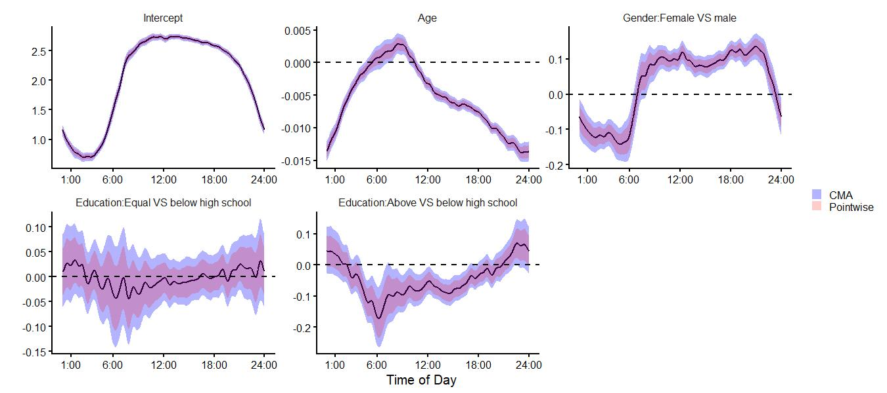{width=800px}

^[We use $\log(1+MIMS)$ as outcome]
^[Intercept refers to those with age 50, BMI 29.2, PIR 2.47, Mexican-Hispanic, no CHD history, and lower-than-high-school education]

## Results on NHANES: Noise

$$
\tiny
\begin{aligned}
Y_i(t)&={\sum\limits_{p=1}^PX_{ip}{A_p(s)}}+{\sum\limits_{j=1}^J\xi_{ij}\phi_j(s)}+\mathbf{\epsilon_i(s)}
\end{aligned}
$$

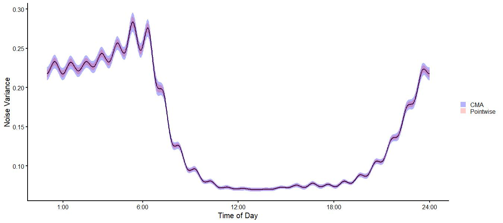{width=800px}

## Results on NHANES: Variance

$\tiny Y_i(t)={\sum\limits_{p=1}^PX_{ip}{A_p(s)}}+\mathbf{\sum\limits_{j=1}^J\xi_{ij}\phi_j(s)}+\mathbf{\epsilon_i(s)}$

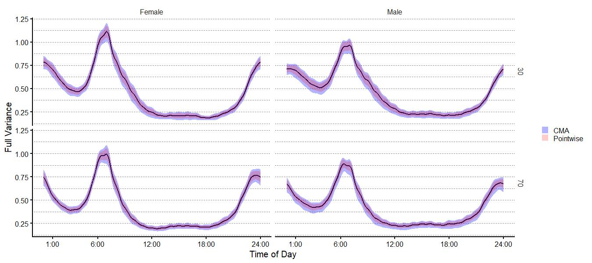{width=900px}

^[All groups are Non-hispanic white, have education above high school level, have no history of coronary heart disease, BMI of 21 and poverty index ratio (PIR) of 2.5]

## Comparing Variability between Subgroups

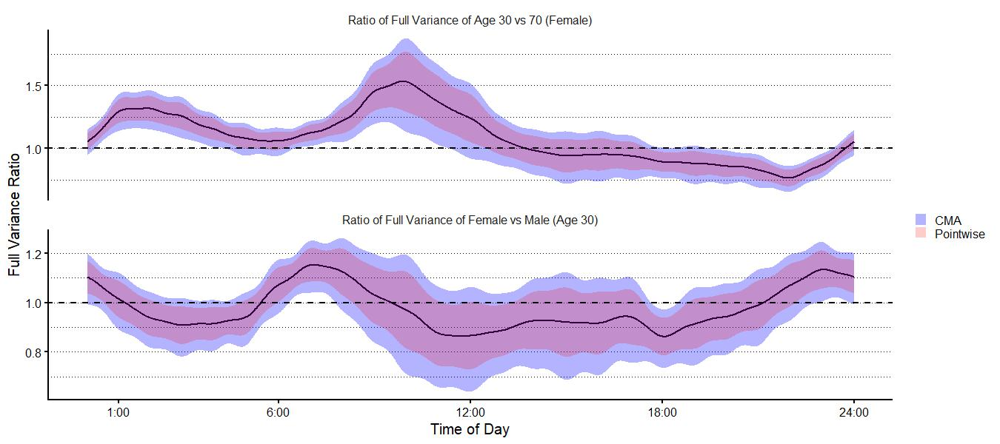